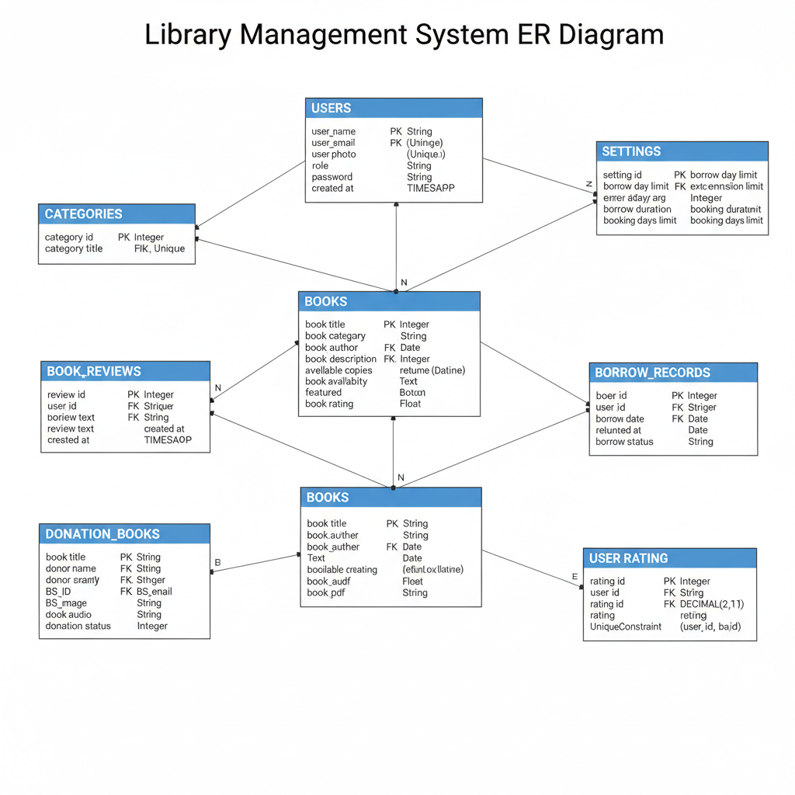

# 📚 Library Management System (LMS)

Full-Stack Web Application – A modern digital library platform for managing physical and digital books.  
Supports patrons (users) and administrators (library staff) with full role-based access control (RBAC).

## Table of Contents
1. [Project Overview](#project-overview)
2. [User Roles & Access](#user-roles--access)
3. [Frontend Overview](#frontend-overview)
5. [Backend Overview](#backend-overview)
6. [Core Features](#core-features)
7. [Technical Stack](#technical-stack)
8. [Routing & State Management](#routing--state-management)
9. [API Endpoints](#api-endpoints-highlights)
10. [Security & Error Handling](#security--error-handling)
11. [Project Structure](#project-structure)
12. [Developer Commands](#developer-commands)
13. [Contributing](#contributing)
14. [System Architecture](#system-architecture)
15. [User Flow Diagram](#user-flow-diagram)
16. [Database / ERD](#database--erd-simplified)
17. [License & Contact](#license--contact)

## Project Overview

The Library Management System (LMS) is a web-based platform that simplifies management of both physical and digital library resources.

Goals:
- For Users: Search, borrow, and return books, submit reviews.
- For Administrators: Manage inventory, users, and digital assets.
- For Libraries: Maintain accurate tracking and reporting for circulation data.

Screenshots (Placeholder):
- 🏠 site page / My library 
- 🧭 Admin Dashboard
- 
 ## User Roles & Access
- 
Standard User (Patron)
- Search and browse books  
- Borrow and return books  
- View borrowing history  
- Submit ratings and reviews
- 
Administrator (Librarian / Staff)
- All standard user permissions  
- Add, update, delete books  
- Manage categories & digital assets  
- View all loans and user activity
- 
## Getting Started
 Prerequisites
- Node.js v18+
- npm or yarn
- Python v3.8+
- PostgreSQL (or SQLite for development)
- 
Backend Setup
```bash
cd backend
python -m venv .venv
source .venv/bin/activate  # macOS/Linux
pip install -r requirements.txt
cp .env.example .env  # Edit database and MinIO credentials
alembic upgrade head
uvicorn app.main:app --reload

 Frontend Setup

cd frontend
npm install
npm run dev

Access:
Frontend → http://localhost:5173

Backend → http://localhost:8000/doc
 ## Frontend Overview

    Built with React + Vite + Tailwind CSS + DaisyUI

    Role-based route protection (RoleBasedRoute)

    Global auth state via React Context API

    Responsive, mobile-first UI

    Axios for API communication

##  Backend Overview

    FastAPI with async SQLAlchemy ORM

    PostgreSQL as primary database

    MinIO (S3-compatible) for file storage

    Service-repository modular architecture

    JWT-based authentication & RBAC

##  Core Features
User Features
    
    Search/browse books by title, author, or ISBN

    Borrow and return books

    Rate and review titles

    Track personal loan history

Admin Features

    Add, edit, delete books and categories

    Manage user loans and assets

    Upload and organize digital media (PDFs, covers)

##  Technical Stack
Layer	Technology:
Frontend	React + Vite + Tailwind CSS + DaisyUI
Routing	React Router DOM v6
State Management	React Context API
HTTP Client	Axios
Backend	FastAPI
ORM	SQLAlchemy (Async)
Database	PostgreSQL
File Storage	MinIO
Authentication	JWT, RBAC

##  Routing & State Management
    Role-based route protection.
    AuthProvider manages login state.
    Conditional layout shells for each role.

##  API Endpoints (Highlights)
📦 Authentication & User Interaction

+----------------+--------+------------------------+---------------+---------------------------+
| Endpoint       | Method | Body / Query           | Response      | Notes                     |
+----------------+--------+------------------------+---------------+---------------------------+
| auth/register  | POST   | email, password        | 201 Created   | 409 if email exists       |
| auth/login     | POST   | email, password        | 200 OK (JWT)  | 401 Unauthorized          |
| books/rate/{id}| POST   | rating, review_text    | 201 Created   | 400 if already rated      |
+----------------+--------+------------------------+---------------+---------------------------+

📦 Catalog & Borrowing

+------------------+--------+-----------------------------------+
| Endpoint         | Method | Notes                             |
+------------------+--------+-----------------------------------+
| books            | GET    | Query: category, search, pagination|
| books/{id}       | GET    | Detailed book info                 |
| books/borrow/{id}| POST   | Borrow a book (auth only)          |
| books/return/{id}| POST   | Return a book (auth only)          |
+------------------+--------+-----------------------------------+

📦 Admin Operations

+-------------------+--------+--------------------------------------+
| Endpoint          | Method | Notes                                |
+-------------------+--------+--------------------------------------+
| admin/books       | POST   | Add book with MinIO upload           |
| admin/books/{id}  | PUT    | Update book                          |
| admin/books/{id}  | DELETE | Delete book (if not borrowed)        |
| admin/loans       | GET    | View all loans                       |
+-------------------+--------+--------------------------------------+

##  Security & Error Handling
    JWT authentication and RBAC
    Standard HTTP responses:
        400 – Bad Request
        401 – Unauthorized
        403 – Forbidden
        404 – Not Found
        409 – Conflict
        422 – Validation error

##  Project Structure

Project_LMS
├── backend
│   ├── app
│   │   ├── api     
│   │   ├── core  
│   │   ├── models    
│   │   ├── services
│   │   └── main.py
│   ├── alembic       
│   ├── requirements.txt
│   └── .env
├── frontend
│   ├── public
│   ├── src
│   │   ├── api
│   │   ├── components
│   │   ├── context
│   │   ├── pages
│   │   ├── routes
│   │   ├── styles
│   │   └── main.jsx
│   ├── package.json
│   └── vite.config.js
└── README.md

🔹 Developer Commands
Action	Command:
Run backend =	uvicorn app.main:app --reload
Run frontend =	npm run dev
Build frontend	npm run build
Lint frontend	npx eslint . --ext .js,.jsx
Format code	npx prettier --write .
🔹 Contributing
    Fork the repo
    Create a new branch (feature/your-feature)
    Commit and push changes
    Open a Pull Request

##  System Architecture

+-------------------+      HTTP/API       +-------------------+
|   React Frontend  | <----------------> |   FastAPI Backend |
|  SPA + RBAC/Auth  |                    |  Business Logic   |
+-------------------+                    +-------------------+
        |                                      |
        v                                      v
+-------------------+                    +-------------------+
|      PostgreSQL   | <----------------> |      MinIO        |
|    Book & Loan DB |                    |  Book Assets (PDFs, Covers) |
+-------------------+                    +-------------------+



🔹 User Flow Diagram
Standard User (Patron)

Login/Register → Browse/Search Books → Borrow/Return → Rate/Review

Administrator (Librarian/Staff)

Login/Register → Admin Dashboard → Manage Books → Manage Loans → Manage Assets

##  Database / ERD (Simplified)

+---------+       +---------+       +---------+
|  Users  |       |  Books  |       |  Loans  |
+---------+       +---------+       +---------+
| id      |<----->| id      |<----->| id      |
| name    |       | title   |       | user_id |
| email   |       | author  |       | book_id |
| role    |       | ISBN    |       | status  |
| password|       | stock   |       | borrowed_at |
+---------+       +---------+       | returned_at |
                                     +---------+

+---------+
| Reviews |
+---------+
| id      |
| user_id |
| book_id |
| rating  |
| text    |
+---------+
